# Cybersecurity Home Lab (Rebuilt)

## Overview

This repository documents my rebuilt cybersecurity home lab. The objective of this lab is to gain practical experience in penetration testing, web application security, networking, system administration, and vulnerability assessment through hands-on practice.

## Lab Infrastructure

### Attacker Systems

#### Kali Linux

* Fresh installation
* Updated and upgraded packages
* Configured networking

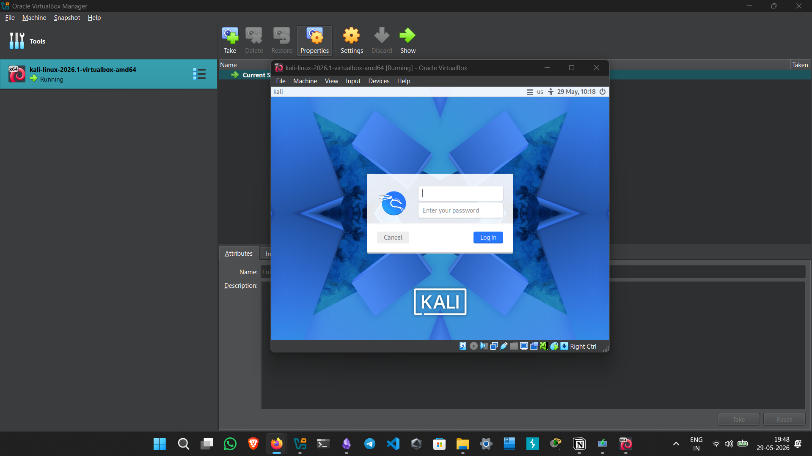

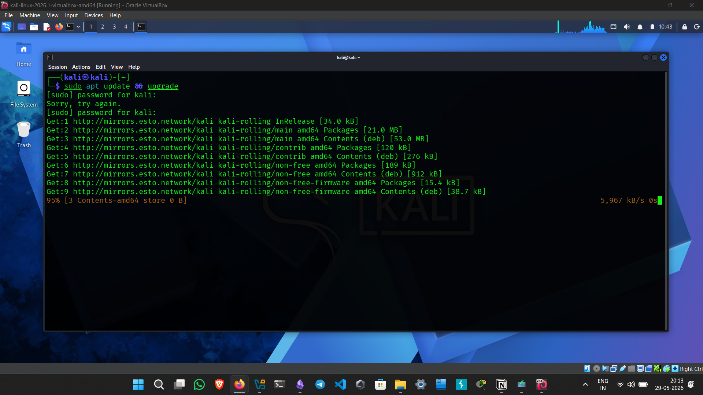

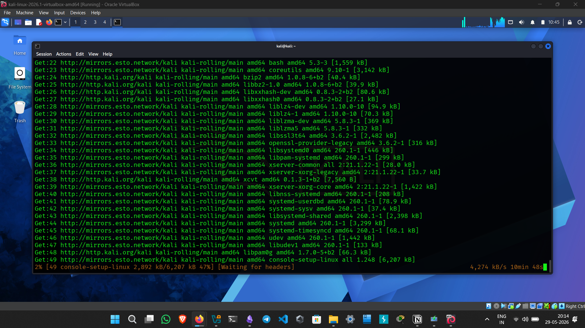

#### Windows Subsystem for Linux (WSL)

* Kali Linux installed and configured
* Ready for command-line security tools and scripting

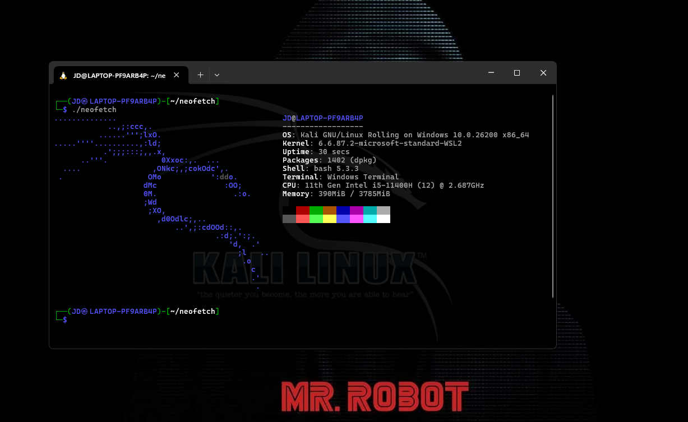

### Target Systems

#### Windows 10

* Installed and configured

  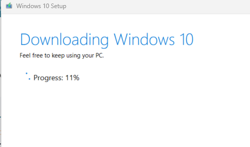
  
  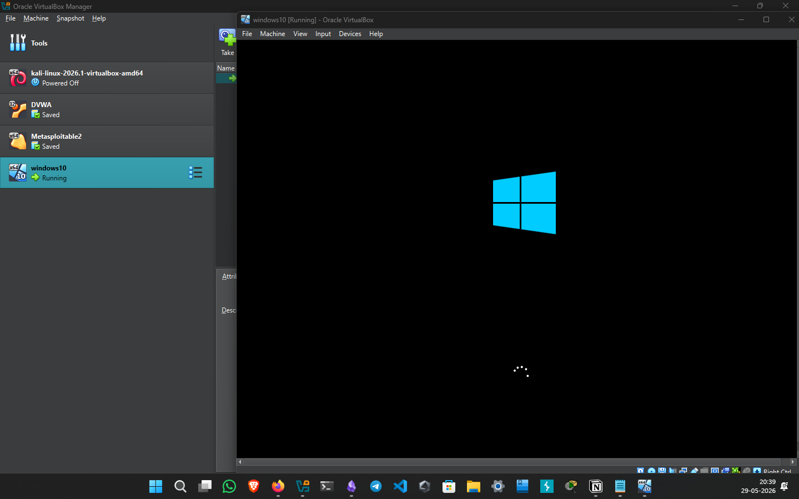
  
#### Metasploitable 2

* Vulnerable Linux machine for security testing

*  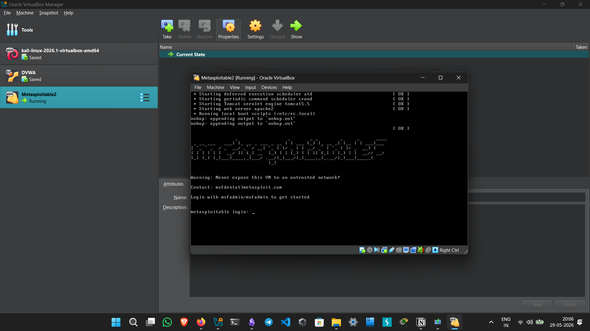

#### DVWA (Damn Vulnerable Web Application)

* Configured for web security exercises

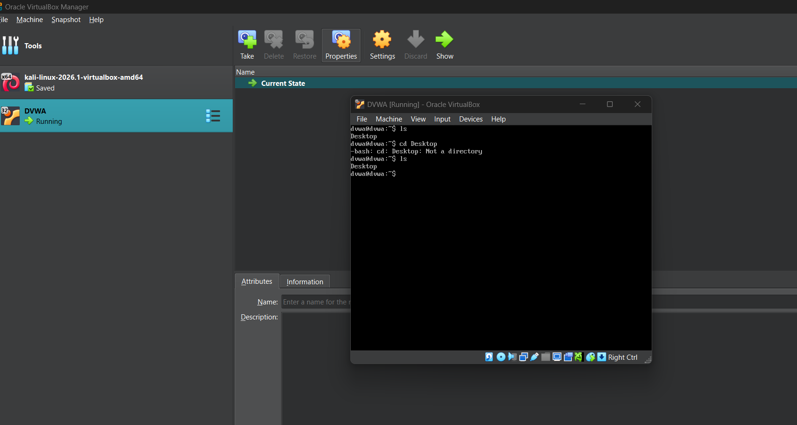

## Security Tools

### Burp Suite

* Installed and configured
* Ready for web application testing

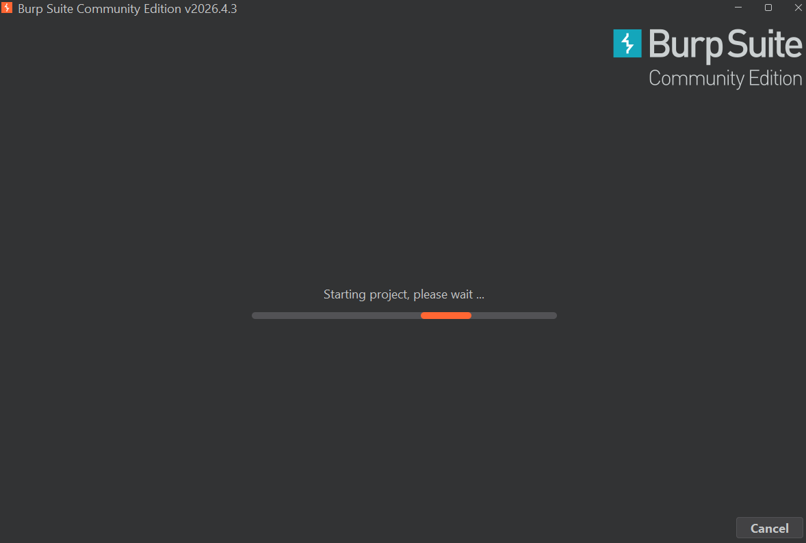

### Wireshark

* Installed and configured
* Used for packet capture and network traffic analysis

## Learning Platforms

Accounts configured on:
* Hack The Box (HTB)

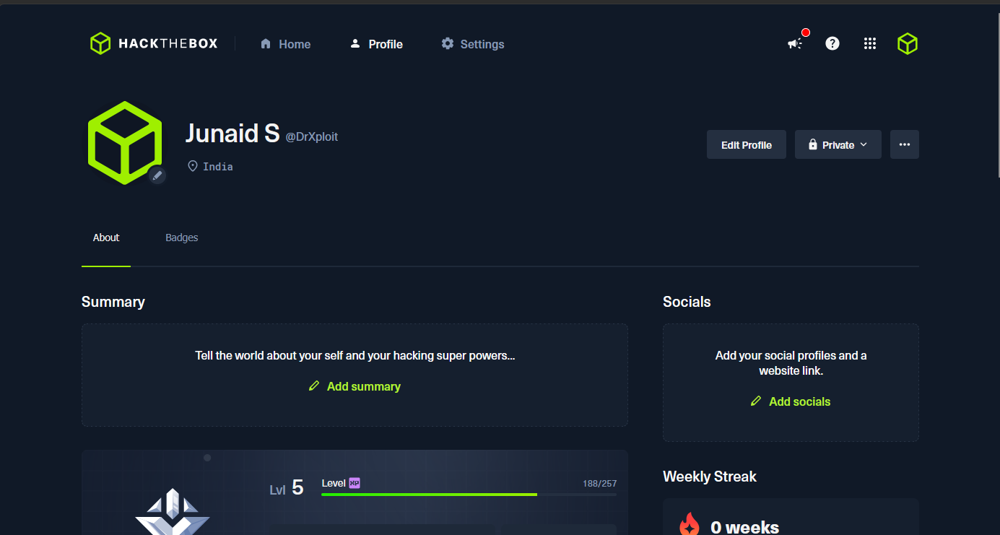

* TryHackMe

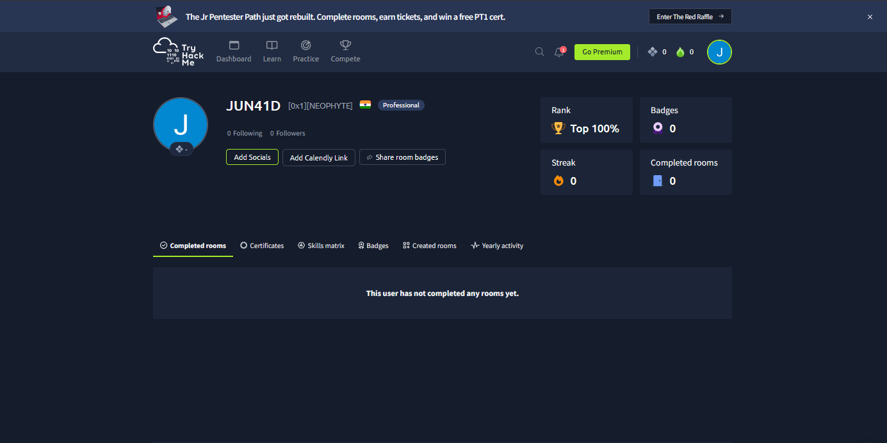

* PortSwigger Web Security Academy

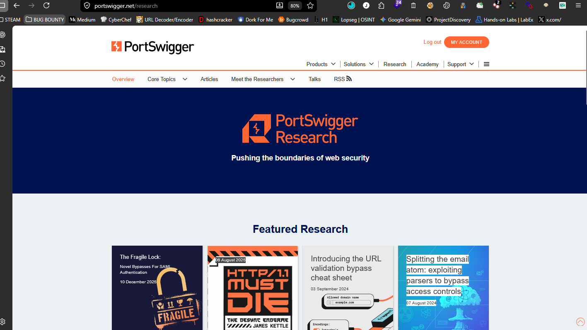

## Lab Objectives

### Networking

* Network discovery
* Service enumeration
* Protocol analysis
* Packet inspection

### Web Application Security

* SQL Injection
* Cross-Site Scripting (XSS)
* Authentication vulnerabilities
* Session management flaws
* Access control testing

### Penetration Testing

* Reconnaissance
* Enumeration
* Vulnerability assessment
* Exploitation fundamentals
* Reporting

### Operating Systems

* Linux administration
* Windows administration
* Security hardening
* Privilege escalation concepts

## Current Status

### Completed

* [x] Rebuilt home lab from scratch
* [x] Installed Kali Linux
* [x] Updated and upgraded packages
* [x] Configured networking
* [x] Installed Windows 10
* [x] Configured WSL (Kali Linux)
* [x] Deployed Metasploitable 2
* [x] Configured DVWA
* [x] Installed Burp Suite
* [x] Installed Wireshark
* [x] Created HTB account
* [x] Created TryHackMe account
* [x] Created PortSwigger Academy account

### Next Steps

* [ ] Configure advanced lab networking
* [ ] Perform Nmap enumeration exercises
* [ ] Complete PortSwigger Academy labs
* [ ] Conduct web application testing on DVWA
* [ ] Capture and analyze network traffic
* [ ] Begin TryHackMe learning paths
* [ ] Start documenting lab findings and walkthroughs

## Disclaimer

This lab environment is intended solely for educational purposes and authorized security testing within a controlled environment.
